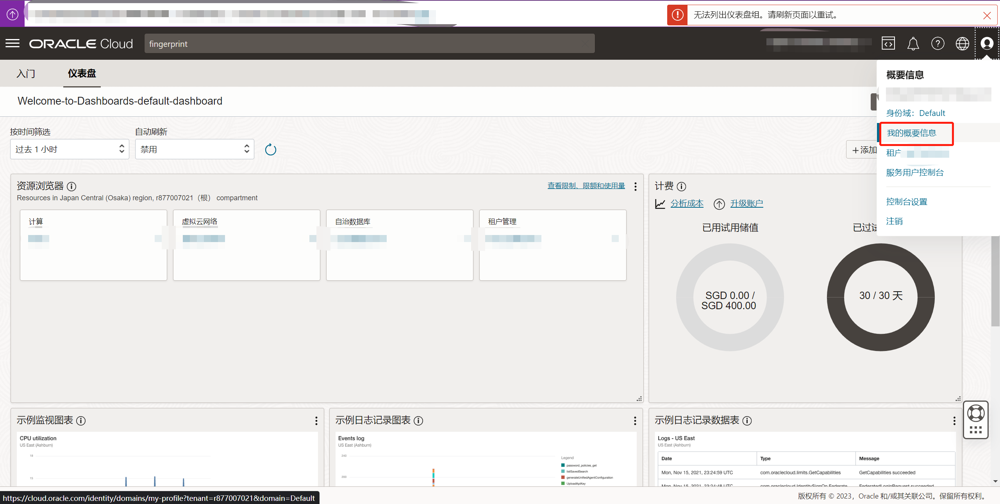
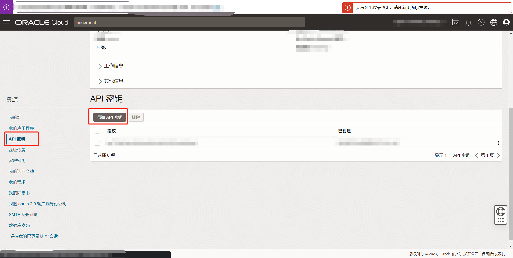
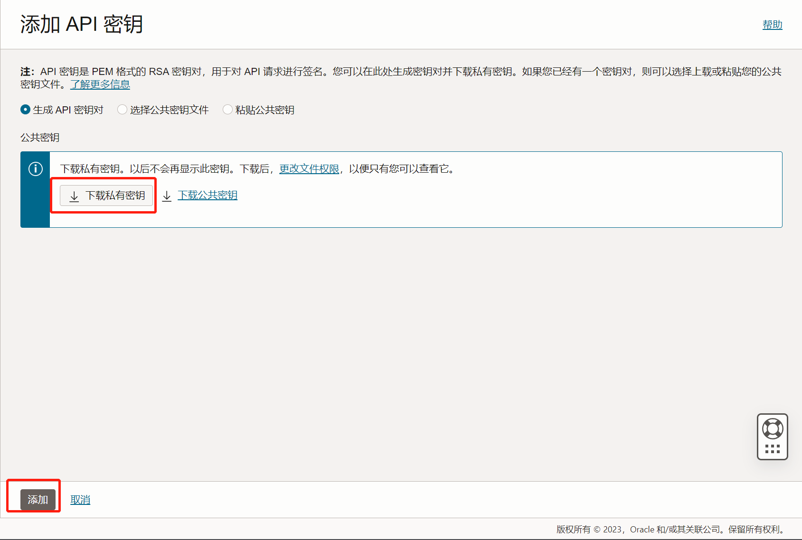
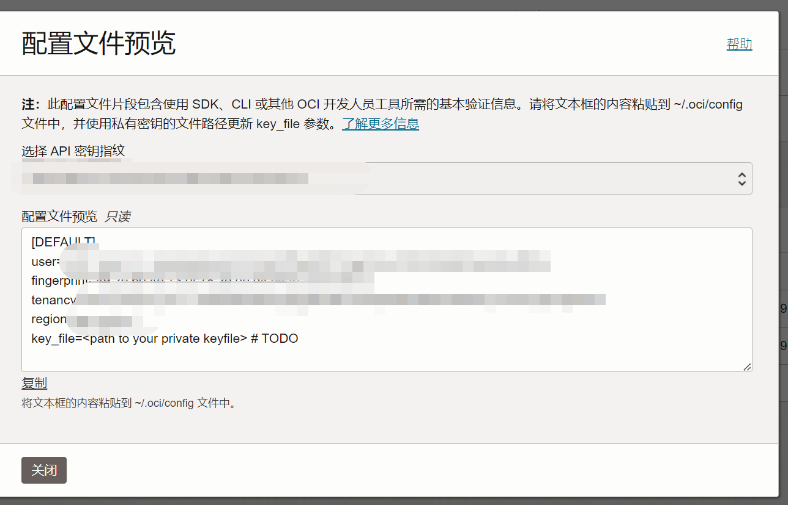
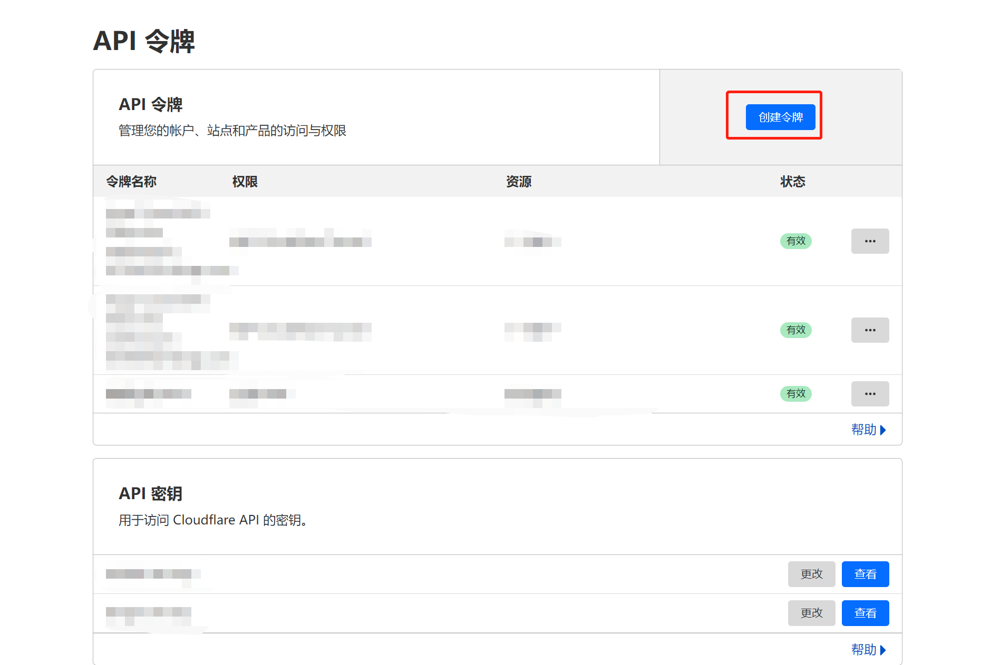
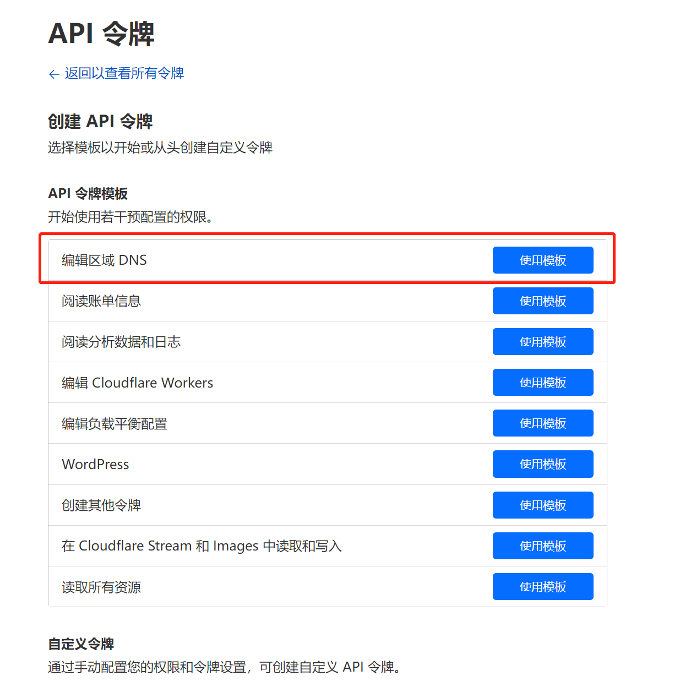
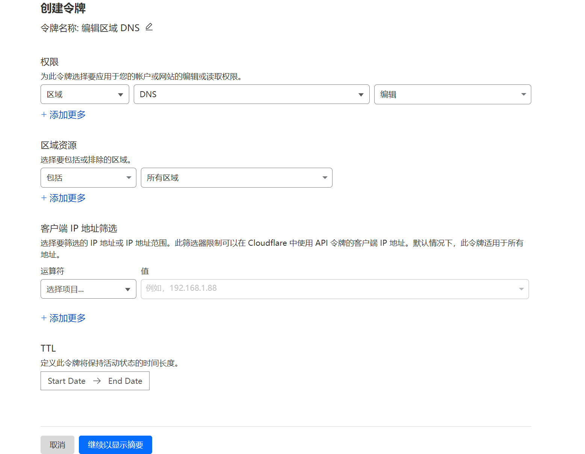
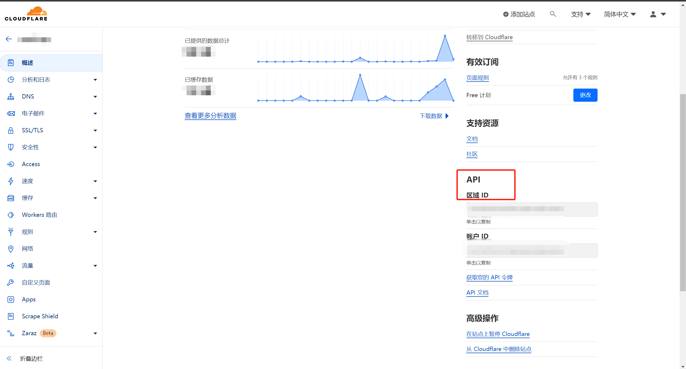

自动检测 Oracle Cloud 虚拟机的IP在国内是否能够连接，如果不能连接则自动更改IP直至能够连接成功，并自动将新的IP同步至 cloudflare DNS中

## 必要条件

- Oracle cloud 账号
- OCI 环境
- cloudflare 账号（可选）

## 使用方法

### 创建虚拟机

创建虚拟机实例，注意创建虚拟机时不要选择自动生成IP，选择不分配公共 IPv4 地址

创建一个预留的公共 IP 地址，并将其关联至刚刚创建的虚拟机

### 生成 OCI 配置文件

登录 Oracle Cloud   Infrastructure

进入个人信息界面



进入个人信息后，再左下角菜单选项中找到 API密钥



点击添加



点击下载私有密钥，然后点击确认



会生成对应的密钥信息

将上面生成的config配置信息复制下来

创建 ~/.oci/config  配置文件，并将上面的config配置信息粘贴进去

### cloudflare 配置信息

登录 cloudflare

进入：https://dash.cloudflare.com/profile/api-tokens 生成一个 api_key

点击创建令牌



选择编辑区域DNS。如果有其他需求自行更改





创建即可

API_KEY生成成功后，还需要 区域ID，在

https://dash.cloudflare.com/ 中可以看到

进入网站



可以看到区域IP

将 API_KEY、区域ID放在上面生成的 oci config中

``` ini
cloudflare_api_key=API_KEY

cloudflare_zone_id=区域ID

cloudflare_dns_names=a.xxx.com b.xxx.com
```

这儿的cloudflare_dns_names支持多个 DNS记录，我是一个域名开启了代理，另一个域名没有开，所以有两个，你有多个也可以添加更多，用空格分隔

最终的 oci config 配置文件如下

``` ini
[DEFAULT]
user=xxx
fingerprint=xxx
tenancy=xxx
region=xxx
key_file= ~/.oci/xxx.pem
private_ip_id=xxx
cloudflare_api_key=xxx
cloudflare_zone_id=xxx
cloudflare_dns_names=a.xxx.com b.xxx.com
```

private_ip_id：调用脚本中的 get_latest_public_ip 可以获取

key_file 请更改为自己实际的的证书文件地址，就是刚刚生成 oci 配置文件时下载的文件

更多功能等待更新

